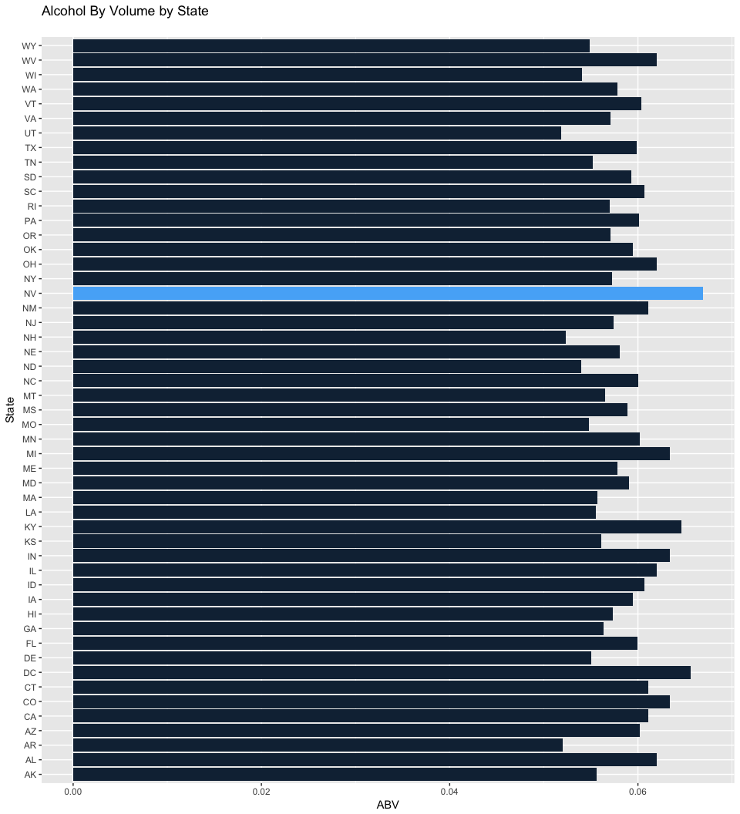
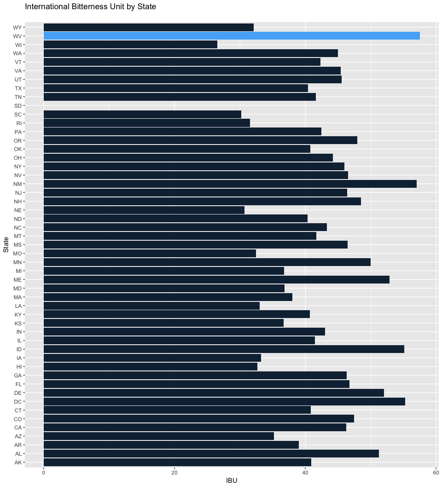
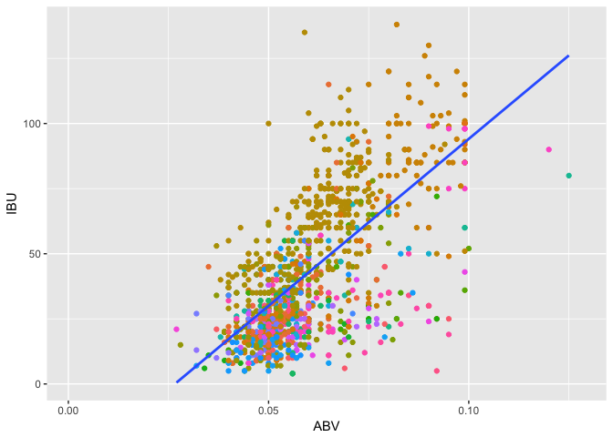

# Beer type by region
Matt Pavlovich & Steven Millett  
October 4, 2017  


## Beer type by region Business growth: Case Study

</br>
This is a systematic study of the most popular types of beers and where they are popular. We obtained demographic data from Beer Advocate with brewery information by State and the most popular beers and their breweries, where we will make the case of what some popular beers that can be made for a state given the state's most popular beer and the characteristic of the 100 different styles of beers. 
</br>
Some things to note - we will be talking about two main characteristics of beer, IBU (International Bitterness Unit) and ABV (Alcohol by Volume). While there are other characteristics that contribute to the flavor of a beer, for the purposes of this business analysis we are going to assume these are the primary components that make up a beer's flavor. 
</br>


## Loading the Data for breweries and beer
###### The following code loads the Breweries and Beers data from their respective .csv files and then displays the first 5 rows of each.

```r
breweryData <- read.csv("Data/Breweries.csv",header = TRUE)
beerData <- read.csv("Data/Beers.csv", header = TRUE)
kable(head(breweryData,5), caption="Head of Breweries.csv")
```


Table: Head of Breweries.csv

 Brew_ID  Name                        City            State 
--------  --------------------------  --------------  ------
       1  NorthGate Brewing           Minneapolis     MN    
       2  Against the Grain Brewery   Louisville      KY    
       3  Jack's Abby Craft Lagers    Framingham      MA    
       4  Mike Hess Brewing Company   San Diego       CA    
       5  Fort Point Beer Company     San Francisco   CA    

```r
kable(head(beerData,5),caption="Head of Beers.csv")
```


Table: Head of Beers.csv

Name                   Beer_ID     ABV   IBU   Brewery_id  Style                             Ounces
--------------------  --------  ------  ----  -----------  -------------------------------  -------
Pub Beer                  1436   0.050    NA          409  American Pale Lager                   12
Devil's Cup               2265   0.066    NA          178  American Pale Ale (APA)               12
Rise of the Phoenix       2264   0.071    NA          178  American IPA                          12
Sinister                  2263   0.090    NA          178  American Double / Imperial IPA        12
Sex and Candy             2262   0.075    NA          178  American IPA                          12

</br>
Here we are loading the data from the raw CSV files to work on and present the information. As we go all of the steps that we take to work on the information will be labeled and detailed so you can easily update the source files and use this file to present the updated information. 
</br>

## What are the number of breweries per state?

###### The following code derives the numbers of breweries by state, adds it as a column, and then displays the data in order of most breweries per state (descending). 

```r
frequencyOfBrewies <- as.data.frame(table(breweryData$State))
colnames(frequencyOfBrewies) <- c("State","Number of Breweries")
kable(frequencyOfBrewies[order(-frequencyOfBrewies$`Number of Breweries`),],row.names = FALSE)
```


State    Number of Breweries
------  --------------------
CO                        47
CA                        39
MI                        32
OR                        29
TX                        28
PA                        25
MA                        23
WA                        23
IN                        22
WI                        20
NC                        19
IL                        18
NY                        16
VA                        16
FL                        15
OH                        15
MN                        12
AZ                        11
VT                        10
ME                         9
MO                         9
MT                         9
CT                         8
AK                         7
GA                         7
MD                         7
OK                         6
IA                         5
ID                         5
LA                         5
NE                         5
RI                         5
HI                         4
KY                         4
NM                         4
SC                         4
UT                         4
WY                         4
AL                         3
KS                         3
NH                         3
NJ                         3
TN                         3
AR                         2
DE                         2
MS                         2
NV                         2
DC                         1
ND                         1
SD                         1
WV                         1

</br>
From the above table we see the number of breweries in descending order. It looks like there are greater possibility for competition if we open a brewery in Colorado, California, or Michigan. 
</br>

#Combining Brewery and Beer information

###### The following code merges the Brewery and Beer data by Brewery_id and Brew_ID.  It then cleans up the column names and prints out the first 6 rows as well as the last 6 rows.

```r
populationData <- merge(beerData, breweryData,by.x="Brewery_id", by.y="Brew_ID")
names(populationData) <- c("Brewery_ID", "Beer Name", "Beer_ID", "ABV", "IBU", "Style", "Ounces", "Brewery Name", "City", "State")
kable(head(populationData,6),row.names = FALSE)
```


 Brewery_ID  Beer Name        Beer_ID     ABV   IBU  Style                                  Ounces  Brewery Name        City          State 
-----------  --------------  --------  ------  ----  ------------------------------------  -------  ------------------  ------------  ------
          1  Get Together        2692   0.045    50  American IPA                               16  NorthGate Brewing   Minneapolis   MN    
          1  Maggie's Leap       2691   0.049    26  Milk / Sweet Stout                         16  NorthGate Brewing   Minneapolis   MN    
          1  Wall's End          2690   0.048    19  English Brown Ale                          16  NorthGate Brewing   Minneapolis   MN    
          1  Pumpion             2689   0.060    38  Pumpkin Ale                                16  NorthGate Brewing   Minneapolis   MN    
          1  Stronghold          2688   0.060    25  American Porter                            16  NorthGate Brewing   Minneapolis   MN    
          1  Parapet ESB         2687   0.056    47  Extra Special / Strong Bitter (ESB)        16  NorthGate Brewing   Minneapolis   MN    

```r
kable(tail(populationData,6),row.names = FALSE)
```


 Brewery_ID  Beer Name                    Beer_ID     ABV   IBU  Style                      Ounces  Brewery Name                    City            State 
-----------  --------------------------  --------  ------  ----  ------------------------  -------  ------------------------------  --------------  ------
        556  Pilsner Ukiah                     98   0.055    NA  German Pilsener                12  Ukiah Brewing Company           Ukiah           CA    
        557  Heinnieweisse Weissebier          52   0.049    NA  Hefeweizen                     12  Butternuts Beer and Ale         Garrattsville   NY    
        557  Snapperhead IPA                   51   0.068    NA  American IPA                   12  Butternuts Beer and Ale         Garrattsville   NY    
        557  Moo Thunder Stout                 50   0.049    NA  Milk / Sweet Stout             12  Butternuts Beer and Ale         Garrattsville   NY    
        557  Porkslap Pale Ale                 49   0.043    NA  American Pale Ale (APA)        12  Butternuts Beer and Ale         Garrattsville   NY    
        558  Urban Wilderness Pale Ale         30   0.049    NA  English Pale Ale               12  Sleeping Lady Brewing Company   Anchorage       AK    

</br>
Here we combine the Brewery and Beer information so we can get an understanding of the types of beers that are made in each state. These two tables were combined on the Brewery ID number which is a unique ID assigned to each brewery. This combined information will be what we are going to work on going forward as it helps understand demographic and location information for each beer in addition to providing insight into the preferred styles of beer for each state.

</br>

## Number of NA's in each column
###### The following code prints out the number of NA's in our merge data set.

```r
kable(colSums(is.na(populationData)))
```


-------------  -----
Brewery_ID         0
Beer Name          0
Beer_ID            0
ABV               62
IBU             1005
Style              0
Ounces             0
Brewery Name       0
City               0
State              0
-------------  -----

</br>
Due to the source of the data we are missing some information regarding the flavor and alcohol content of some of the beers. Given we are missing over 1000 values for the flavor characteristic, IBU, we will have to make some guesses later on for what the characteristic of a beer should be based off of the ABV. 

</br>

## Alcohol Content and International Bitterness Unit by state
###### The following code results in two horizontally rotated bar charts - one for Alcohol by Volume by State, and another for the International Bitterness Unit by State.  Both charts are rotated to allow for all 50 states to easily show up.  The max value in each chart is highlighted a different color for ease of reference.

```r
fetchMean <- function(column) {
  mean(column, na.rm = T)
}


plotFlippedBarChart <- function(data, xColumn, yColumn, main, xLab, yLab) {
  ggplot(data=data, aes(xColumn, yColumn, fill = ifelse(yColumn == max(yColumn), 1, 0)) ) + geom_bar(stat = "identity") + coord_flip() + labs(title= main, x=xLab, y=yLab) + theme(legend.position="none")
}

populationData.by.state <- split(populationData, f = populationData$State, drop = T)

mean.IBU.by.state <- sapply(populationData.by.state, function(x) { fetchMean(x$IBU) })
mean.ABV.by.state <- sapply(populationData.by.state, function(x) { fetchMean(x$ABV) })

states <- sort(as.character(unique(populationData$State)))

# convert states and abv means to data frame
df.abv.by.state <- data.frame(mean.ABV.by.state)
df.abv.by.state$State = states
row.names(df.abv.by.state) <- NULL
df.abv.by.state <- df.abv.by.state[c(2, 1)]
names(df.abv.by.state) <- c("State", "ABV")
df.abv.by.state$ABV[is.na(df.abv.by.state$ABV)] <- 0

# convert states and ibu means to data frame
df.ibu.by.state <- data.frame(mean.IBU.by.state)
df.ibu.by.state$State = states
row.names(df.ibu.by.state) <- NULL
df.ibu.by.state <- df.ibu.by.state[c(2, 1)]
names(df.ibu.by.state) <- c("State", "IBU")
df.ibu.by.state$IBU[is.na(df.ibu.by.state$IBU)] <- 0


plotFlippedBarChart(data = df.abv.by.state, xColumn = df.abv.by.state$State, yColumn = df.abv.by.state$ABV, main = "Alcohol By Volume by State\n", xLab = "State", yLab = "ABV")
```

<!-- -->

```r
plotFlippedBarChart(data = df.ibu.by.state, xColumn = df.ibu.by.state$State, yColumn = df.ibu.by.state$IBU, main = "International Bitterness Unit by State\n", xLab = "State", yLab = "IBU")
```

<!-- -->

</br>

## Which state's beer has the highest alcohol content (on average)?
###### The following code prints out which State's beer has the highest alcohol by volume.

```r
kable(df.abv.by.state[df.abv.by.state$ABV == max(df.abv.by.state$ABV), ])
```

     State       ABV
---  ------  -------
34   NV       0.0669

</br>
From the barchart above we are able to see that Nevada makes beers that have more alcohol on average than other states. Comparing the different states, we see that Nevada makes beer on average with an ABV of 6.69%.
</br>

## Which state's beer is the most bitter (on average)?
###### The following code prints out which State's beer has the highest IBU rating.

```r
kable(df.ibu.by.state[df.ibu.by.state$IBU == max(df.ibu.by.state$IBU), ])
```

     State     IBU
---  ------  -----
50   WV       57.5

</br>
We are able to confirm from comparing the average IBU per state that West Virginia has the highest average IBU of 57.5.
</br>

</br>


## Summary Statistics for ABV
###### The following code prints a summary of the merged data ABV column.

```r
summary(populationData$ABV)
```

```
##    Min. 1st Qu.  Median    Mean 3rd Qu.    Max.    NA's 
## 0.00100 0.05000 0.05600 0.05977 0.06700 0.12800      62
```

</br>
We see that there is a range for the ABV variable, with some of the styles being titled Low Alcohol Beer. The ABV of a given beer can impart certain flavors, which can often taste bitter with lighter beers. It should follow then that breweries would increase the IBU of a beer when the brew has a higher ABV.
</br>

## Plot of ABV and IBU
###### The following code shows a scatter plot of the ABV and IBU to show the positive correlation of IBU to IBU.  A summary of the linear model is also printed.

```r
ggplot(data=populationData,aes(ABV,IBU,color=Style))+geom_point(na.rm = TRUE)+theme(legend.position = "none")+geom_smooth(data=populationData,aes(ABV,IBU),na.rm=TRUE,method="lm",se=FALSE,inherit.aes = FALSE)
```

<!-- -->

```r
linearABV <- lm(IBU~ABV, data=populationData)
linearABV
```

```
## 
## Call:
## lm(formula = IBU ~ ABV, data = populationData)
## 
## Coefficients:
## (Intercept)          ABV  
##       -34.1       1282.0
```

```r
summary(linearABV)
```

```
## 
## Call:
## lm(formula = IBU ~ ABV, data = populationData)
## 
## Residuals:
##     Min      1Q  Median      3Q     Max 
## -78.849 -11.977  -0.721  13.997  93.458 
## 
## Coefficients:
##             Estimate Std. Error t value Pr(>|t|)    
## (Intercept)  -34.099      2.326  -14.66   <2e-16 ***
## ABV         1282.037     37.860   33.86   <2e-16 ***
## ---
## Signif. codes:  0 '***' 0.001 '**' 0.01 '*' 0.05 '.' 0.1 ' ' 1
## 
## Residual standard error: 19.26 on 1403 degrees of freedom
##   (1005 observations deleted due to missingness)
## Multiple R-squared:  0.4497,	Adjusted R-squared:  0.4493 
## F-statistic:  1147 on 1 and 1403 DF,  p-value: < 2.2e-16
```

Based on the scatterplot graph and the linear regression we see a statistically significant relationship (p<0.0001) between the alcohol content of the beer and the bitterness. The linear formula given IBU = -34.1 + 1282*ABV shows us this relationship. From the range of ABV from .1% to 12.8% we get a range from -32.8 to 130 for the IBU. At the lower end this breaks down, but accurately predicts the IBU for the higher alcohol beer.

## Most popular style
###### The following code creates a new data frame who's aim is to suggest similar beer alternatives (in terms of ABV and IBU) for a particular state.  It also shows that particular state's most popular beer as well the number of breweries in that state in an effort to show untapped market potential. 

```r
#Gets the closest vector from a data frame, given a set vector with coordinates(ABV,IBU)
#Returns a value with the name of the closest vector
nearestNeighbor <- function(temp.ABV,temp.IBU,temp.df,neighbor=1) {
  temp.df$distance<-sqrt(((temp.ABV-temp.df[2])*100)**2+(temp.IBU-temp.df[3])**2)
  temp.df<-temp.df[order(temp.df$distance),]
  temp.df[neighbor,1]
}

#Returns the mode of a given vector
getmode <- function(v) {
   uniqv <- unique(v)
   uniqv[which.max(tabulate(match(v, uniqv)))]
}

populationData.by.style <- split(populationData, f = populationData$Style, drop = T)

mean.IBU.by.style <- sapply(populationData.by.style, function(x) { fetchMean(x$IBU) })
mean.ABV.by.style <- sapply(populationData.by.style, function(x) { fetchMean(x$ABV) })

styles <- sort(as.character(unique(populationData$Style)))

# convert states and abv means to data frame
df.style <- data.frame(mean.ABV.by.style)
df.style$style = styles
df.style$IBU = mean.IBU.by.style
#row.names(df.style) <- NULL
df.style <- df.style[c(2, 1,3)]
names(df.style) <- c("Style", "ABV","IBU")
df.style[is.na(df.style)] <- 0

#Correcting for missing IBU.
#This creates a linear model for the existing ABV and IBU values then returns an IBU
#with the existing ABV.
temp.df.style <- df.style[c(df.style$ABV!=0 & df.style$IBU!=0),]
temp.linear<-lm(IBU~ABV,data=temp.df.style)
temp.df.linear <- data.frame(df.style[c(df.style$ABV==0 | df.style$IBU==0),2])
names(temp.df.linear)<-"ABV"
temp.df.linear <- cbind("ABV"=temp.df.linear,"IBU"=predict(temp.linear,newdata = temp.df.linear))
names(temp.df.linear) <- c("ABV","IBU")

#This merges the values we received from the linear model and joins them where there is a value of 0 in the 
#data frame with existing data.
temp.merge <- sqldf("SELECT * FROM `df.style` LEFT JOIN `temp.df.linear` ON `df.style`.ABV = `temp.df.linear`.ABV AND `df.style`.IBU == 0")
temp.merge[is.na(temp.merge)]<-0
df.style$IBU<-temp.merge[,3]+temp.merge[,5]
df.style[df.style$IBU<0,]$IBU<-0

#We are creating a new data frame with the most popular beer per state. Most popular beer is taken to mean
#the beer that is made the most in the state.
most.popular.style.by.state <- sapply(populationData.by.state, function(x) { getmode(x$Style) })
df.most.popular.style.by.state <- data.frame(most.popular.style.by.state)
df.most.popular.style.by.state$State = states
row.names(df.most.popular.style.by.state) <- NULL
df.most.popular.style.by.state <- df.most.popular.style.by.state[c(2, 1)]
names(df.most.popular.style.by.state) <- c("State", "Style")

#This calls an SQL statement to merge the df.style data frame and the most popular style data frame
#and copying on the columns with state, abv, ibu, and style to the most popular style data frame.
df.most.popular.style.by.state<-sqldf("SELECT State,`df.most.popular.style.by.state`.Style,ABV,IBU FROM `df.most.popular.style.by.state` LEFT JOIN `df.style` ON `df.most.popular.style.by.state`.Style = `df.style`.Style ")


#Here we are creating a new column for the most popular style data frame with the closest style in terms of ABV and IBU
#to the current most popular beer in the state.
df.most.popular.style.by.state<-cbind(df.most.popular.style.by.state,"Recommended Alternative"=mapply(function(x,y) { nearestNeighbor(x,y,df.style,2)},df.most.popular.style.by.state$ABV,df.most.popular.style.by.state$IBU))

finalAnalysis<-sqldf("SELECT `df.most.popular.style.by.state`.State,Style,[Recommended Alternative],[Number of Breweries] FROM `df.most.popular.style.by.state` LEFT JOIN 'frequencyOfBrewies' ON `df.most.popular.style.by.state`.State = 'frequencyOfBrewies'.State ")

#Output of a table with the state, most popular beer, and a good alternative given the current most popular.
kable(finalAnalysis[order(-finalAnalysis$`Number of Breweries`),],row.names = FALSE)
```


State   Style                            Recommended Alternative                Number of Breweries
------  -------------------------------  ------------------------------------  --------------------
CO      American Pale Ale (APA)          Extra Special / Strong Bitter (ESB)                     47
CA      American IPA                     American Black Ale                                      39
MI      American IPA                     American Black Ale                                      32
OR      American IPA                     American Black Ale                                      29
TX      American Pale Ale (APA)          Extra Special / Strong Bitter (ESB)                     28
PA      American IPA                     American Black Ale                                      25
MA      American IPA                     American Black Ale                                      23
WA      American IPA                     American Black Ale                                      23
IN      American IPA                     American Black Ale                                      22
WI      American Adjunct Lager           Light Lager                                             20
NC      American IPA                     American Black Ale                                      19
IL      American Pale Ale (APA)          Extra Special / Strong Bitter (ESB)                     18
NY      American IPA                     American Black Ale                                      16
VA      American IPA                     American Black Ale                                      16
FL      American IPA                     American Black Ale                                      15
OH      American IPA                     American Black Ale                                      15
MN      American IPA                     American Black Ale                                      12
AZ      American IPA                     American Black Ale                                      11
VT      American Double / Imperial IPA   American Barleywine                                     10
ME      American Pale Ale (APA)          Extra Special / Strong Bitter (ESB)                      9
MO      American IPA                     American Black Ale                                       9
MT      American IPA                     American Black Ale                                       9
CT      American Amber / Red Ale         Smoked Beer                                              8
AK      American IPA                     American Black Ale                                       7
GA      American IPA                     American Black Ale                                       7
MD      American IPA                     American Black Ale                                       7
OK      American Blonde Ale              American Pale Wheat Ale                                  6
IA      American IPA                     American Black Ale                                       5
ID      American IPA                     American Black Ale                                       5
LA      American Blonde Ale              American Pale Wheat Ale                                  5
NE      American Pale Ale (APA)          Extra Special / Strong Bitter (ESB)                      5
RI      Märzen / Oktoberfest             English Brown Ale                                        5
HI      American IPA                     American Black Ale                                       4
KY      American IPA                     American Black Ale                                       4
NM      American IPA                     American Black Ale                                       4
SC      American Pale Ale (APA)          Extra Special / Strong Bitter (ESB)                      4
UT      American IPA                     American Black Ale                                       4
WY      American Pale Ale (APA)          Extra Special / Strong Bitter (ESB)                      4
AL      American Pale Ale (APA)          Extra Special / Strong Bitter (ESB)                      3
KS      American IPA                     American Black Ale                                       3
NH      Berliner Weissbier               Gose                                                     3
NJ      American IPA                     American Black Ale                                       3
TN      American IPA                     American Black Ale                                       3
AR      American Pilsner                 American Amber / Red Lager                               2
DE      American IPA                     American Black Ale                                       2
MS      American IPA                     American Black Ale                                       2
NV      Schwarzbier                      English Pale Ale                                         2
DC      Scotch Ale / Wee Heavy           Doppelbock                                               1
ND      American Pale Ale (APA)          Extra Special / Strong Bitter (ESB)                      1
SD      American Amber / Red Ale         Smoked Beer                                              1
WV      American Pale Ale (APA)          Extra Special / Strong Bitter (ESB)                      1

</br>
Above we see a table of the states, their most popular beer, recommended alternative to make in the state, and the number of breweries in the states. So to avoid a crowded market we are recommending possibly going into the Dakotas where North Dakota might like an Extra Special/Strong Bitter and South Dakota would appreciate a Smoked Beer. If you are starting a brewery in California or Michigan we recommend introducing an American Black Ale. 


```r
kable(df.style[df.style$Style=="American Black Ale"|df.style$Style=="Extra Special / Strong Bitter (ESB)",],row.names = FALSE)
```


Style                                        ABV        IBU
------------------------------------  ----------  ---------
American Black Ale                     0.0689714   68.90000
Extra Special / Strong Bitter (ESB)    0.0564737   45.71429

## Conclusion
We can make a strong recommendation to look into brewing American Black Ales and Extra Special/ Strong Bitter as these would complement some of the most popular beers on the market. With ABV and IBU characteristics that are lower or about the same as most states these styles of beers are not too extreme compared to what is being produced in most states. As well, these styles could have mass appeal in a variety of markets and popularity of breweries. In states with more breweries these styles could work as well as states that have smaller craft beer markets. 
